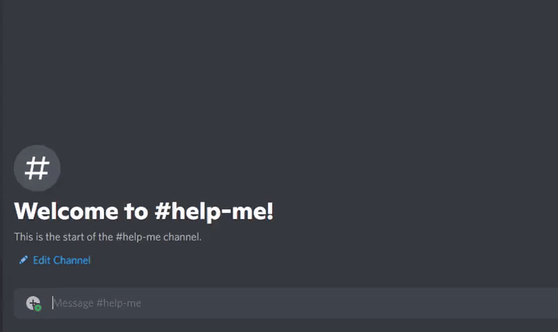

<p align="center">
  
</p>

# Caption It Jerma <sup><sub>Community Maintained</sub></sup>

<p align="center">
  <b>Turn any text into a Jerma985 reaction GIF for Discord!</b>
</p>

A Discord bot that generates custom GIFs by overlaying text on Jerma985 reaction GIFs. Fun, fast, and fully customizable.


---

## Table of Contents

- [Project Status](#project-status)
- [Features](#features)
- [Quick Start](#quick-start)
- [Documentation](#documentation)
- [Contributing](#contributing)
- [Requirements](#requirements)
- [License](#license)

---

## Project Status

> **Note:** This is a community-maintained fork. The original creator (pauleks) has abandoned the project, and this version is maintained by the community to keep it functional and improve its features.


## What It Does

Transform any text into a Jerma985 GIF:

- **Slash Commands**: `/jerma text:When the impostor is sus`
- **Context Menus**: Right-click any message → "Turn into GIF"
- **Custom GIFs**: Add your own Jerma GIFs to expand the collection


## Features

- 🎭 **Multiple GIF Options**: Choose from dozens of Jerma reaction GIFs
- 🔄 **Queue System**: Handles up to 100 requests with smart rate limiting
- 📝 **Rich Text Support**: Unicode, emojis, and Discord custom emojis
- 🛠️ **Easy Setup**: Automated first-time configuration
- 🔧 **Customizable**: Add your own GIFs and tweak performance settings
- 🔐 **Moderation**: Built-in user banning and rate limiting
- 💾 **Persistent Storage**: Keeps your custom GIFs and settings safe
- ⚡ **Fast & Lightweight**: Minimal resource usage


## Quick Start

### 1. Install Prerequisites

- **Node.js 20+** and **FFmpeg**
  - **Ubuntu/Debian:**
    ```bash
    sudo apt install nodejs npm ffmpeg
    ```
  - **macOS:**
    ```bash
    brew install node ffmpeg
    ```
  - **Windows:**
    - [Download Node.js](https://nodejs.org/en/download/)
    - [Download FFmpeg](https://ffmpeg.org/download.html) and add it to your PATH

### 2. Setup Bot

```bash
git clone https://github.com/MucciDev/jermacaption
cd jermacaption
npm install
```

### 3. Configure Discord

- Create a Discord application at [discord.com/developers/applications](https://discord.com/developers/applications)
- Create a bot and copy the token
- Configure environment variables in `config/.env`

### 4. Run

```bash
npx ts-node src/index.ts
```

## Contributing

Contributions are welcome! See the [Development Guide](docs/DEVELOPMENT.md) for:
- Code structure and architecture
- Adding new features
- Testing and debugging
- Performance optimization

If you have questions or need help, open an issue or join the community discussions.


## Requirements

- Node.js 20.x
- FFmpeg for GIF processing
- Discord bot token and application ID


## License

This is a community fork of the original project by pauleks. Please respect the original creator's work while contributing to this maintained version.
